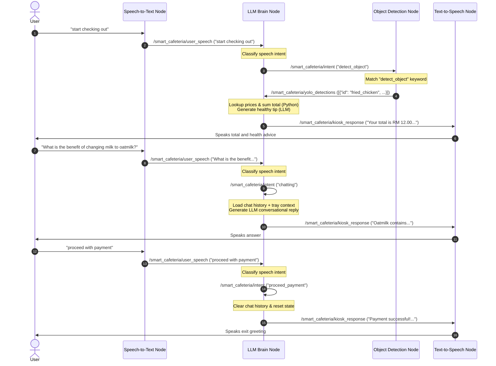

# Smart Cafeteria Self-Checkout Kiosk System

This repository contains the software components for the **Smart Cafeteria Self-Checkout Kiosk**, a touchless, intelligent checkout terminal powered by **ROS 1 Noetic**, **Computer Vision (YOLO)**, and **Large Language Models (LLMs)**.

The kiosk transitions self-checkout from a rigid transaction machine into a personalized Corporate Wellness Advisor. It automatically counts food items on a tray, calculates subtotals, verifies transaction intents via natural language speech, and provides friendly, tailored nutrition tips to consumers.

---

## System Architecture & Conversational Flow

The kiosk functions as a distributed ROS network where nodes communicate asynchronously over topics to coordinate vision, speech, and billing logic:



### Shared ROS Topics

* **`/smart_cafeteria/user_speech`** (`std_msgs/String`): Conversational transcripts published by the Speech-to-Text (STT) node.
* **`/smart_cafeteria/intent`** (`std_msgs/String`): Transaction control keywords published by the LLM Brain and subscribed to by YOLO and LLM:
  * `"detect_object"`: Commands the YOLO node to perform a tray scan.
  * `"chatting"`: Commands the LLM node to generate a conversational answer using chat history.
  * `"proceed_payment"`: Triggers billing transaction completion.
  * `"cancel_transaction"`: Aborts checkout and resets active variables.
* **`/smart_cafeteria/yolo_detections`** (`std_msgs/String`): JSON array of detected tray items published by the YOLO Vision node.
* **`/smart_cafeteria/kiosk_response`** (`std_msgs/String`): Spoken output transcripts published by the LLM Brain and subscribed to by the Text-to-Speech (TTS) node.

---

## Project Packages & Subsystems

### 1. LLM Brain Subsystem (`smart_cafeteria`)
Handles cognitive reasoning, intent classification, price matching database lookup, and nutrition Q&A.

* **[azure_ai_client.py](smart_cafeteria/nodes/azure_ai_client.py)**: Integrates Microsoft Azure OpenAI API via the `openai` Python SDK. Performs classification, price-matching, wellness tips generation, and multi-turn chat completions.
* **[llm_brain_node.py](smart_cafeteria/nodes/llm_brain_node.py)**: State-management ROS node. Caches YOLO tray scans, matches items and calculates prices in Python, and handles the intent topic routing loop.
* **[llm_test_publisher.py](smart_cafeteria/nodes/llm_test_publisher.py)**: Test bench utility for local simulation testing (no ROS) or active ROS topic tracing.
* **[requirements.txt](requirements.txt)**: Central Python library dependencies list.
* **[setup_win_test_env.bat](setup_win_test_env.bat)**: Automated Conda environment creation batch script for Windows local testing.

### 2. Computer Vision Subsystem (Future Node)
*Add your YOLO Object Detection node description and launch details here.*

### 3. Speech Subsystem (Future Node)
*Add your Speech-to-Text (STT) and Text-to-Speech (TTS) node descriptions here.*

---

## Installation & Setup

### Windows PC (Local Testing)
1. Copy `.env.example` to `.env` and fill in your Azure OpenAI API keys and model deployment details.
2. In a **Miniforge Prompt**, run the Windows test environment script:
   ```cmd
   setup_win_test_env.bat
   ```

### Linux / Robot (ROS Node Machine)
In your ROS Python environment, install the project dependencies:
```bash
/home/mustar/robot_project
source /home/mustar/robot_project/venv/bin/activate
source /home/mustar/Desktop/WQF7010-SMARTCAFETERIA/catkin_ws/devel/setup.bash

pip install -r requirements.txt

cd ~/Desktop/WQF7010-SMARTCAFETERIA/catkin_ws/src/smart_cafeteria/
```

---

## Testing & Execution

### 1. Run Standalone Simulation Testing
Validate the client code and prompts locally on Windows or Linux:
```bash
python smart_cafeteria/nodes/llm_test_publisher.py --local
```

### 2. Launch the Kiosk ROS Nodes
Build your Catkin workspace first:
```bash
cd ~/catkin_ws
catkin_make
source devel/setup.bash
```

Load your environment credentials and launch the LLM Brain Node:
```bash
export $(cat .env | xargs)
roslaunch smart_cafeteria llm_brain.launch offline_mode:=false
```

### 3. Trace and Mock Topics
Use the interactive CLI test tool to publish mock inputs:
```bash
rosrun smart_cafeteria llm_test_publisher.py
```


## temp use
sample receipt json:
{
    "source": "yolo_vision_node",
    "currency": "RM",
    "total_bill_RM": 2.5,
    "order_details": [
        {
            "name": "Coca Cola can",
            "count": 1,
            "unit_price_RM": 2.5,
            "subtotal_RM": 2.5
        }
    ],
    "unknown_items": []
}
