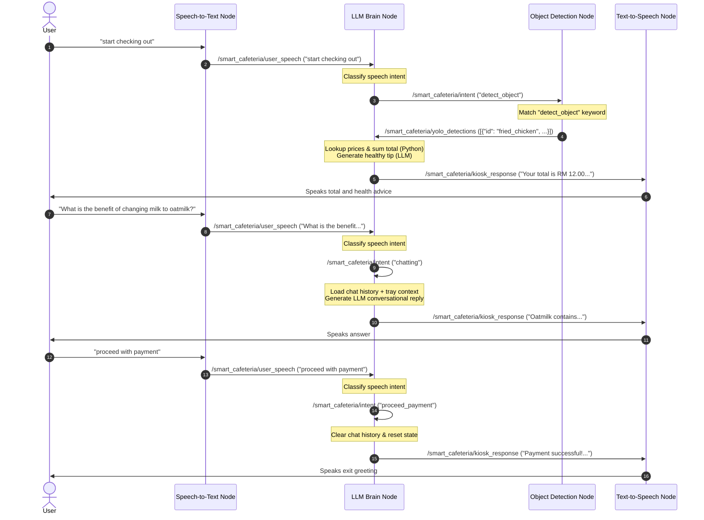

# Smart Cafeteria Self-Checkout Kiosk System

This repository contains the software components for the **Smart Cafeteria Self-Checkout Kiosk**, a touchless, intelligent checkout terminal powered by **ROS 1 Noetic**, **Computer Vision (YOLO)**, and **Large Language Models (LLMs)**.

The kiosk transitions self-checkout from a rigid transaction machine into a personalized Corporate Wellness Advisor. It automatically counts food items on a tray, calculates subtotals, verifies transaction intents via natural language speech, and provides friendly, tailored nutrition tips to consumers.

---

## System Architecture & Conversational Flow

The kiosk functions as a distributed ROS network where nodes communicate asynchronously over topics to coordinate vision, speech, and billing logic:



### Shared ROS Topics

* **`/smart_cafeteria/user_speech`** (`std_msgs/String`): Conversational transcripts published by the Speech-to-Text (STT) node.
* **`/smart_cafeteria/intent`** (`std_msgs/String`): Transaction control keywords published by the LLM Brain and subscribed to by YOLO and LLM:
  * `"detect_object"`: Commands the YOLO node to perform a tray scan.
  * `"chatting"`: Commands the LLM node to generate a conversational answer using chat history.
  * `"proceed_payment"`: Triggers billing transaction completion.
  * `"cancel_transaction"`: Aborts checkout and resets active variables.
* **`/smart_cafeteria/yolo_detections`** (`std_msgs/String`): JSON array of detected tray items published by the YOLO Vision node.
* **`/smart_cafeteria/kiosk_response`** (`std_msgs/String`): Spoken output transcripts published by the LLM Brain and subscribed to by the Text-to-Speech (TTS) node.

## Installation and Execution

### From ZIP Folder

1. **Unzip** the project archive:
   ```bash
   unzip WQF7010-SMARTCAFETERIA.zip
   ```

2. **Navigate** to the Catkin workspace:
   ```bash
   cd WQF7010-SMARTCAFETERIA/catkin_ws
   ```

3. **Build** the workspace:
   ```bash
   catkin_make
   source devel/setup.bash
   ```

4. **Create and activate** a Python virtual environment, then install dependencies:
   ```bash
   python -m venv venv
   source venv/bin/activate
   pip install -r src/smart_cafeteria/requirements.txt
   ```

5. **Launch** the Smart Cafeteria system:
   ```bash
   roslaunch smart_cafeteria smart_cafeteria.launch
   ```

### From GitHub

1. **Create a project folder** and initialise the Catkin workspace:
   ```bash
   mkdir WQF7010-SMARTCAFETERIA
   cd WQF7010-SMARTCAFETERIA
   mkdir -p catkin_ws/src
   cd catkin_ws
   catkin_make
   ```

2. **Clone the repository** into the `src` directory, then rebuild:
   ```bash
   cd src
   git clone https://github.com/23070844/SmartCafeteria.git smart_cafeteria
   cd ..
   catkin_make
   ```

3. **Configure environment variables** — copy the example file and fill in credentials:
   ```bash
   cp src/smart_cafeteria/.env.example src/smart_cafeteria/.env
   nano src/smart_cafeteria/.env    # edit with your API keys
   ```

4. **Create and activate** a Python virtual environment, then install dependencies:
   ```bash
   python -m venv venv
   source venv/bin/activate
   pip install -r src/smart_cafeteria/requirements.txt
   ```

5. **Source the workspace and launch**:
   ```bash
   source devel/setup.bash
   roslaunch smart_cafeteria smart_cafeteria.launch
   ```
